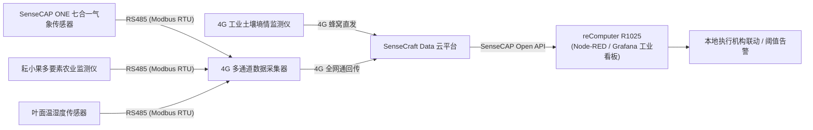
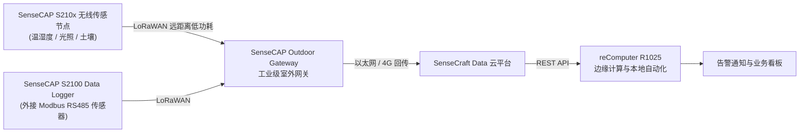

# M5 环境感知与数据采集

**一句话定位：** 基于工业级传感器（土壤/气象/水质）与双通信链路（LoRaWAN / 4G DTU），构建覆盖农业、环保与市政场景的低功耗环境监测与数据集成方案。

## 目标场景

面向连栋温室大棚、设施园艺、河道水质监测、城市内涝点与工业仓储等场景，解决偏远点位布线取电成本高、传感器协议多且不兼容、异常响应滞后、监测数据分散无法联动闭环等问题。本方案提供两条通信变体：**4G 蜂窝直连版**（国内主流）通过 RS485/Modbus 工业探针与 4G 数据采集器直连云平台；**LoRaWAN 广域版**（Mission Pack）通过太阳能供电与 LoRaWAN 网关实现野外免布线部署。L3 可在 reComputer R1025 上通过 Node-RED 调用 SenseCAP Open API，实现本地阈值判断与执行机构联动。

## 通信技术与架构变体对比

| 方案变体 | 核心硬件组合 | 通信方式与特点 | 典型适用环境 |
| --- | --- | --- | --- |
| **LoRaWAN 版 (Mission Pack)** | SenseCAP Outdoor Gateway + SenseCAP S210x 无线传感器 + Hazard Response Mission Pack（T1000-E + reComputer R1025） | LoRaWAN 长距离低功耗无线传输，网关集中上报，免现场布线 | 野外大面积农场、无市电林区、远距离多点位监测 |
| **4G 版 (国内版)** | 4G 多通道数据采集器 (4 路 RS485 通道，可经分线器扩展至最多 32 个传感器) + 工业传感器 + reComputer R1025 | 4G 蜂窝全网通直连，插卡即用，标准 Modbus 协议 | 连栋温室大棚、市政泵站、工厂车间等有蜂窝网络覆盖区域 |

## 核心痛点（环境监测与现场运维视角）

| 痛点 | 表现与工程代价 | 解决方案与架构 |
| --- | --- | --- |
| 偏远点位取电与布线成本高 | 野外山地、河流断面上百米至数公里铺设线缆工程量巨大，施工与维护成本高昂 | 太阳能供电 + LoRaWAN / 4G 无线通信，免破土布线，开箱即装 |
| 传感器协议多且不兼容 | 现场采购多厂商设备，各自定义私有协议，二次开发和协议适配周期长 | 统一采用标准 Modbus RTU / RS485 接口与标准工业航空接头，免代码快速配置 |
| 异常响应滞后与人工巡检耗时 | 霜冻、水质恶化、土壤干旱靠人工定期巡检，故障发现晚且耗费人力 | 传感器定时上报，云端/边缘端实时阈值判断，告警经 SenseCraft App 消息中心推送（支持短信、邮件与外部 Webhook 联动） |
| 缺乏标准化自动化与第三方对接能力 | 采集到的环境数据停留在云端大屏或手机 App，无法与既有灌溉/风机等执行机构联动，也无法对接第三方业务系统 | 提供 SenseCAP Open API 开放接口标准，支持本地部署 Node-RED 边缘计算节点，实现「感知 → 告警 → 控制」就地闭环 |

## 方案核心价值

- **开箱即用与免布线**：无线传感器自带电池与磁吸开关，支持扫码快速绑定与分钟级入网
- **工业级防护与长寿命**：IP66 工业级防护，超低功耗设计，适配野外长周期无人值守监测
- **云端与边缘双重闭环**：支持 SaaS 云平台实时大屏与报表归档，同时支持本地 Node-RED 离线自动化控制

## 能力层级

| 能力层级 | 核心目标 | 典型实操与交付 |
| --- | --- | --- |
| **L1 展示层 · 体验 · 体验课（1 天）** | 理解环境感知系统架构与数据流向 | 观摩多节点传感器接线与数据上报流程，在 SenseCraft Data 平台与移动端 App 查看实时数据看板与报表 |
| **L2 顾问层 · 实战 · 实战课（2–3 天）** | 掌握传感器接线、Modbus 配置与规则告警 | 独立完成 RS485 传感器物理接线、从机地址与寄存器配置、绑定 4G 采集器/网关并设置多级阈值告警 |
| **L3 设计层 · 交付 · 交付课（3–5 天）** | 掌握 API 数据对接与 Node-RED 本地自动化 | 调用 SenseCAP Open API 获取历史数据，使用 reComputer R1025 部署 Node-RED 编写本地阈值联动控制逻辑并对接 Grafana |

## 能力指标

### L1 展示层（体验）

- 理解 4G DTU 与 LoRaWAN 网关在物联网数据采集中的不同拓扑结构与适用条件
- 熟练使用 SenseCraft Data 网页端与移动端 App 查看多维度环境参数与历史趋势曲线
- 了解土壤、水质、气象等典型工业传感器的测量原理与部署注意事项

### L2 顾问层（实战）

- 掌握 RS485 差分接线、5V/12V 电源分配与 Modbus RTU 寄存器寻址配置
- 熟练完成 4G 数据采集器（或 LoRaWAN 网关）的设备绑定与轮询周期设置
- 配置 3 类以上业务告警策略（如温度上限报警、土壤水分过低告警、设备离线通知）

### L3 设计层（交付）

- 掌握 SenseCAP Open API 鉴权（Access ID / Access Key，HTTP Basic Auth）与遥测数据提取接口调用
- 在 reComputer R1025 上部署 Node-RED 编排本地自动化控制流（根据传感器数值触发执行机构）
- 将环境时序数据接入 InfluxDB 与 Grafana，设计私有化数据监控大屏

## 适用场景

- **智慧农业与设施园艺**：土壤温湿度/EC 监测、温室 CO2 浓度调控、精准水肥灌溉联动
- **水质与生态环境监测**：河道断面与养殖水体 pH 值监测、户外微型气象站
- **智慧市政与城市内涝**：立交桥与低洼积水监测、管网温湿度与压力状态监测
- **工业仓储与厂房监控**：恒温恒湿库房监测、工业除尘与废气排放环境参数监控

## 技术栈

Modbus RTU · RS485 · LoRaWAN · 4G 全网通 · SenseCraft Data · Node-RED · SenseCAP Open API · Grafana · InfluxDB · reComputer R1025

## 能力边界

- **核心能力**：多环境要素采集（土壤/气象/气体/水质）、无线广域传输、云端报表与告警、本地轻量逻辑联动
- **系统边界**：环境传感采样周期通常为 1~60 分钟（视现场功耗与电池策略配置），**不适用于毫秒级闭环运动控制**
- **网络依赖**：4G 版需依赖现场蜂窝基站覆盖与有效流量 SIM 卡；LoRaWAN 版需评估网关与节点间的视距覆盖范围

## 课程速览

| 项目 | 说明 |
| --- | --- |
| **培训天数** | L1 展示层 · 体验（1 天）｜ L2 顾问层 · 实战（2–3 天）｜ L3 设计层 · 交付（3–5 天） |
| **配套硬件** | 详见 [M5.2 培训设备清单](M5.2 培训设备清单.md)：分为国内 4G 蜂窝直连版（4G 数据采集器 + 工业气象/农业/土壤 RS485 传感器群 + reComputer R1025）与海外 LoRaWAN 广域版（SenseCAP 室外网关 + S2100 系列无线节点）两条独立交付路线 |
| **学员基础** | L1：无需编程与硬件经验，具备基本电脑与手机操作能力即可；L2：建议具备 RS485/Modbus 或电子接线基础，能读懂传感器接线图；L3：建议具备 HTTP API 调用、JSON 解析与 Linux 命令行基础 |
| **学完交付物** | L1：完成多节点传感器接入与 SenseCraft Data 实时监视，形成数据链路认知；L2：完成一套多传感器 Modbus 接线与 3 类业务告警策略配置；L3：交付 Node-RED 阈值联动控制流与 SenseCAP Open API 对接示例（含 Grafana 大屏） |

## 系统解决方案架构

### 路线 A：4G 蜂窝直连版（国内主流）

### 路线 B：LoRaWAN 广域版（海外免布线）

