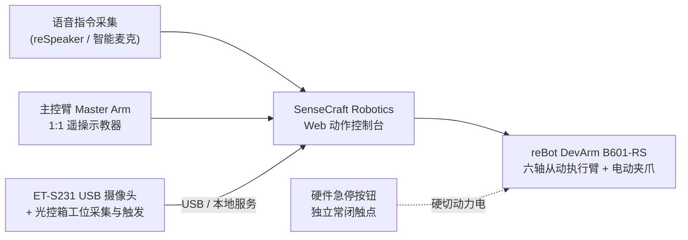
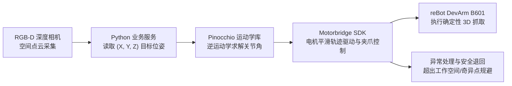

# M6 机器人控制与具身智能

**一句话定位：** 基于六轴桌面机械臂（reBot DevArm）与多模态感知接口，面向商业方案与工程落地，掌握从选型取舍、主从遥操、多动作编排到 3D 空间精准抓取与具身智能前瞻开发。

**模块属性：** 独立模块，无先修课程要求；各级入场门槛见文末「课程速览 · 学员基础」。

**技术栈：** reBot DevArm (B601-DM/RS) · reComputer（控制器/部署主机）· SenseCraft Robotics · reSpeaker（语音套件）· ET-S231 广角 USB 摄像头 · 双机位支架 · 数据采集光控箱 · RGB-D 深度相机 · Python (Pinocchio / Motorbridge) · Isaac Sim (数字孪生)

## 核心痛点 → 方案

| 痛点 | 典型现状 | 解决方案与架构 |
| --- | --- | --- |
| 底层控制与算法门槛高 | 传统机械臂教学从运动学推导与电机控制讲起，应用侧人员上手周期长 | 动作层抽象与可视化编排：模拟器预演、手掰示教、标准动作库配置，全程不碰底层电机控制 |
| 自然语言到物理执行断层 | 大语言模型多局限于文本生成，缺乏接入物理执行机构的标准路径 | 采用「自然语言描述 → LLM 意图解析 → 动作序列编排 → 确认闸门 → 机械臂 API 执行」的标准流程 |
| 视觉与执行协同调试复杂 | 从零搭建分拣/搬运演示需联调视觉识别、运动规划与抓取时序，多系统集成难度大 | 模块化集成设计：检测事件触发 → HTTP/MQTT 消息通知 → 参数化动作与降级策略 |
| 现场运行安全风险 | 新手操作带动力机械臂，存在碰撞、误入工作空间等物理风险 | 安全规范前置教学：配备硬件级独立急停按钮、物理安全隔离与低速运行规则，严格落实设备安全复位规程 |

## 核心方案价值

- **低门槛首验**：依托模拟器与手掰示教，第一天即可完成动作录制与回放
- **可复用的方案产出**：通过可视化流程编排与标准 API 封装，沉淀模块化微场景方案（分拣线、迎宾展位、物料推送）
- **感知-决策-执行闭环**：打通「视觉/语音触发 → 自然语言编排 → 确认闸门 → 机构执行」全链路协同

## 能力层级

| 能力层级 | 核心目标 | 典型实操与交付 |
| --- | --- | --- |
| **L1 展示层 · 体验 · 体验课（1 天）** | 建立选型取舍与安全认知，完成 SenseCraft 平台开箱、主从遥操与语音夹取首验 | 选型权衡、安全规范与上电流程、SenseCraft 平台操作、主从臂遥操、语音指令夹取 |
| **L2 顾问层 · 实战 · 实战课（2–3 天）** | 掌握 3D 场景优势、动作流程编排与工位视觉事件触发联动 | 3D 空间直觉、多动作流程编排、确认闸门配置、工位视觉数据采集/事件触发与微场景联调 |
| **L3 设计层 · 交付 · 交付课（3–5 天）** | 掌握 3D 空间精准抓取工程闭环，拓展具身大模型与数字孪生视野 | 深度相机 3D 定位与手眼对齐、Pinocchio 角度自动换算、Motorbridge 驱动真机抓取、遥操数采与 VLA 初探 |

## 能力指标

### L1 展示层（体验）

- 理解工业机械臂分类与速度/精度/负载/安全/成本的商业选型权衡
- 掌握机械臂物理工作空间边界、硬件急停使用与安全操作规程
- 掌握 SenseCraft 平台开箱连接，跑通主从遥操与语音指令夹取

### L2 顾问层（实战）

- 能向客户清晰阐述 3D 场景为什么需要六轴机械臂及其选型边界
- 掌握 SenseCraft 多动作流程编排与「生成 → 预览 → 确认 → 执行」安全确认机制
- 掌握基于工位视觉的事件触发与微场景搭建，连续 3 次稳定运行

### L3 设计层（交付）

- **确定性工程底座**：使用深度相机获取目标 3D 物理坐标，通过 Python 调用 Pinocchio 完成电机角度自动换算，利用 Motorbridge 驱动真机完成空间抓取与异常处理
- **具身智能前瞻**：掌握主从遥操动作数据集采集流程，理解 VLA 具身大模型与 Isaac Sim 数字孪生仿真基本原理
- 交付完整 Python 抓取工程源码、遥操数据集与方案设计文档

## 适用场景

- **农产品与工业件外观分拣**：合格品、瑕疵品与疑似品分类抓取
- **轻量自动化产线辅助**：物料移载、工件推送、按序码放
- **展厅展位与教学演示**：语音/视觉交互迎宾、轨迹展示
- **辅助作业与自动化工位**：定时定点巡检摆拍、轻量协作抓取

## 能力边界

- **适用范围**：轻量分拣演示、展位互动、教学实训、低速监督控制
- **系统边界**：不覆盖高速工业节拍（>1 件/秒）、高精度力控装配与 7×24 无人值守严苛工况
- **安全声明**：课程严格执行硬件级急停回路与工作空间安全隔离规程；本课程不替代法定工业安全认证
- **明确不交付**：工业级安全认证背书（ISO 10218 / TS 15066）、微米级精密装配、复杂柔性异形物料抓取

## 课程速览

| 层级 | 天数 | 学员基础 | 学完交付物 |
| --- | --- | --- | --- |
| **L1 展示层 · 体验** | 1 天 | 零基础，具备基本电脑操作技能 | 1 次主从遥操与语音指令抓取成功演示 |
| **L2 顾问层 · 实战** | 2–3 天 | 掌握基础网络配置与系统联动概念 | 1 套工位视觉触发的微场景系统（连续 3 次无异常触发） |
| **L3 设计层 · 交付** | 3–5 天 | 具备基础 Python 编程与 Linux 技能 | 1 套 Python 3D 自动抓取工程源码 + 遥操数据集与交付文档 |

- **配套硬件**：详细设备型号、台架连接与采购规格以 [M6.2 培训设备清单](M6.2 培训设备清单.md) 为准（包含 reBot DevArm B601-RS 机械臂、Master Arm 主动臂、reComputer Super J4012、ET-S231 USB 摄像头、双机位支架、数据采集光控箱、RGB-D 深度相机及工作台附件）。

## 目标场景

面向农产品外观分拣、轻量自动化产线辅助上下料、展厅展位迎宾演示与辅助作业工位等场景，解决传统机械臂教学从运动学推导与电机控制讲起导致应用侧人员上手门槛高、自然语言到物理执行缺乏标准接入路径、视觉与运动规划联调复杂、以及带动力机构现场运行安全风险等问题。本方案以 reBot DevArm B601 六轴机械臂为执行终端，依托 SenseCraft Robotics 平台实现零代码动作编排与主从遥操；L2 引入工位视觉数据采集与事件触发联动；L3 通过 RGB-D 深度相机 + Pinocchio 逆运动学换算 + Motorbridge SDK 打通确定性 3D 空间抓取闭环，并拓展遥操数采与 VLA 具身大模型前沿视野。

## 系统解决方案架构

### L1/L2 动作层与编排联动架构

### L3 确定性 3D 空间抓取闭环架构

