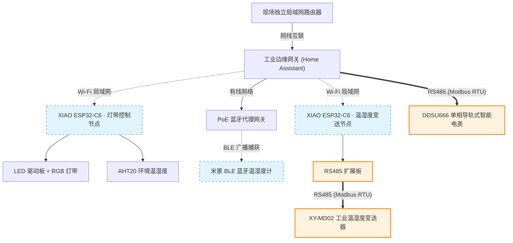

# M1 设备互联与智能管控

**一句话定位：** 基于开源平台（Home Assistant / ESPHome）整合消费级与工业级（Modbus/RS485）设备，实现局域网内的统一数据采集、能耗监控与自动化联动。

## 目标场景

面向商业楼宇、老旧设施、酒店公寓与工厂辅助车间等场景，解决空调、照明、安防等多套子系统独立运行、能耗流向不明、云端依赖与专有协议锁定等问题。本方案以 Home Assistant OS 与 ESPHome 为核心，在局域网内统一接入消费级 Wi-Fi/蓝牙设备与工业级 RS485/Modbus 设备，实现回路级能耗计量、环境状态监视与跨协议自动化联动。

## 核心痛点（客户与现场视角）

| 痛点 | 表现与代价 |
| --- | --- |
| 子系统割裂 | 空间内空调、安防、照明多套系统独立运行，运维人员需多平台切换，数据互不相通 |
| 能耗流向不明确 | 缺乏回路级计量，仅能查看总表账单，无法精确定位高耗能设备与浪费时段 |
| 云端依赖与合规风险 | 部分商业与办公场景对网络依赖敏感，公有云方案存在断网失效风险，且数据出域难以通过审计 |
| 专有协议锁定 | 传统 BA 系统多采用专有封闭协议，设备扩展与更换依赖原厂，改造成本高 |
| 维护与二次开发周期长 | 标准化工业方案难以满足特定场景的联动需求，改动需依赖厂商排期，成本居高不下 |

## 核心痛点 → 方案对比

| 对比维度 | 传统弱电 / BA 系统 | 本方案（HAOS + 边缘硬件） |
| --- | --- | --- |
| **协议兼容** | 专有协议封闭，跨品牌联动困难 | 统一桥接开源与标准协议（Modbus RTU/TCP、MQTT、Zigbee、Wi-Fi） |
| **改造成本** | 升级多需推倒重来，更换整套硬件 | 兼容存量电气与工业设备，以轻量网关实现低成本增量改造 |
| **部署与运行成本** | 专用服务器 + 商业授权费 + 定期维保费 | 软件开源免费，运行于通用边缘硬件（如 reComputer、XIAO） |
| **数据与控制主权** | 依赖厂商公有云，断网受限且数据出域 | 纯本地私有化部署，数据存储于局域网，支持完全离网运行 |
| **扩展与运维** | 功能固化，新增需求依赖厂商支持 | 依托活跃生态与标准接口（YAML / Node-RED），支持自主扩展与维护 |
| **应用定位** | 关键系统（高压配电、消防、电梯控制等） | 系统增值与运维优化（环境联动、能耗精细计量、统一监控看板） |

## 核心方案价值

- **多协议融合**：统一桥接消费级智能设备与 RS485 / Modbus 工业总线设备
- **存量利旧改造**：兼容既有电气回路与变送器，避免推倒重建
- **本地私有化部署**：数据存放在本地网关，保障网络离线下的可用性与数据合规
- **灵活自主编排**：通过 YAML 与 Node-RED 灵活配置自动化逻辑，摆脱单一供应商排期依赖

## 能力层级

| 能力层级 | 核心目标 | 典型实操与交付 |
| --- | --- | --- |
| **L1 展示层 · 体验课（1 天）** | 掌握基础环境搭建与消费级设备接入 | 完成 Home Assistant 快速体验、XIAO ESP32 传感器接入与基础控制仪表盘配置 |
| **L2 顾问层 · 实战课（2–3 天）** | 掌握工业总线协议对接与场景自动化 | 使用 ESPHome 接入 RS485 / Modbus 工业传感器与电表，搭建能耗看板并配置联动 |
| **L3 设计层 · 交付课（3–5 天）** | 掌握跨系统对接与自定义组件开发 | 实现 HA 与第三方系统的 API/MQTT 对接，使用 Node-RED 封装复杂业务流，配置系统备份 |

## 能力指标

### L1 展示层（体验）

- 掌握 Home Assistant 核心概念（界面 Dashboard、实体 Entity、服务 Service、状态 State）
- 完成 XIAO ESP32 + Grove 环境传感器接入 HA
- 能够在 HA 仪表盘中配置卡片并进行状态监视与控制

### L2 顾问层（实战）

- 掌握 Modbus RTU 寄存器配置与 RS485 硬件接线
- 完成导轨式电表接入并搭建 HA Energy 能耗监控看板
- 配置至少 3 种自动化联动策略（如阈值触发、定时任务、传感器联动）

### L3 设计层（交付）

- 实现 HA 与外部系统的数据交互（REST API / MQTT / Webhook）
- 使用 Node-RED 开发符合业务需求的流程逻辑
- 掌握系统配置导出、自动化备份与灾难恢复流程

## 适用场景

- 商业楼宇与办公园区智能化增量改造
- 老旧设施电气与环境监测利旧升级
- 酒店、公寓与公共空间的统一环境管控与能耗审计
- 工厂辅助车间温湿度监视与用电回路计量

## 技术栈

Home Assistant OS · ESPHome · Node-RED · Modbus RTU/TCP · MQTT · Wi-Fi/Zigbee · YAML

## 能力边界

- **适用范围**：跨品牌设备状态聚合、回路能耗计量、环境自动化联动、统一监控看板
- **系统边界**：明确不介入消防、电梯控制、高压配电等安全关键生命系统（仅做单向状态监视，不执行反向控制）

## 课程速览

| 层级 | 天数 | 学员基础 | 学完交付物 |
| --- | --- | --- | --- |
| **L1 展示层 · 体验** | 1 天 | 无需编程基础，会基本电脑操作与本地区域网连接即可 | 1 套 XIAO 传感器节点上线 + HA 仪表盘监控卡片 |
| **L2 顾问层 · 实战** | 2–3 天 | 有基础编程概念，能读懂 YAML 配置文件 | 1 个 Modbus 工业设备接入 + 能耗看板 + 自动化联动策略 |
| **L3 设计层 · 交付** | 3–5 天 | 有 YAML / Node-RED 与网络基础，熟悉 L1–L2 能力 | 跨系统 API/MQTT 对接流程 + 系统备份与灾难恢复方案 |

- **配套硬件**：详细设备型号、台架连接与采购规格以 [M1.2 培训设备清单](M1.2 培训设备清单.md) 为准（包含工业物联网网关、XIAO ESP32-C6、RS485 扩展板、DDSU666 智能电表、XY-MD02 工业变送器及台架套件）。

## 系统解决方案架构

