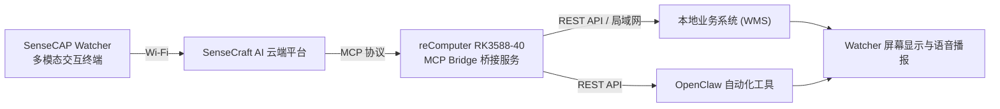
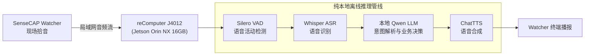

# M2 多模态 AI 交互

一句话定位：基于物理 AI 终端，构建融合边缘视觉、语音与业务系统 API 的多模态空间交互方案。

## 目标场景

面向仓储管理、展厅导览、智能前台与会议空间等场景，解决现场人员需停下手工操作查询业务数据、固定交互终端缺乏空间感知、业务系统封闭难以对接等问题。本方案以 SenseCAP Watcher 为端侧感知入口，通过 MCP 协议桥接本地 WMS/ERP/CRM 等业务系统，实现语音 Agent 自然语言查询、边缘视觉事件触发与自动化任务执行；L3 可在 Jetson Orin NX 上部署纯本地离线语音 AI 管线，满足强隐私与工业隔离网需求。

## 核心痛点（现场与业务视角）

| 痛点 | 典型现状 | 解决方案与架构 |
| --- | --- | --- |
| 现场查询交互繁琐 | 仓管、车间或展厅人员需停下手工操作，通过键盘/手机手动检索数据 | 语音 Agent 唤醒与自然语言查询，实时反馈结构化数据与语音播报 |
| 固定点位缺乏空间感知 | 传统交互终端缺乏视觉上下文，无法主动感知人员靠近或异常动作 | 边缘端轻量视觉推理，支持目标检测、人员状态感知与事件主动触发 |
| 业务系统集成割裂 | 智能终端多为封闭生态，难以与存量 WMS / ERP / CRM 系统对接 | 基于标准 MCP 协议（Model Context Protocol）与 REST API 实现双向工具调用 |
| 隐私与离网运行诉求 | 部分工业与政企场景禁止音频与业务数据上传公网 | 支持从云端轻量方案平滑切换至 Jetson 本地离线语音管线（VAD + ASR + LLM + TTS） |

## 方案核心价值

- **开箱即用与快速验证**：通过云端 LLM 与 SenseCraft 平台，快速完成视觉识别与语音 Agent 策略配置
- **本地数据安全**：业务数据通过本地 MCP 桥接服务在局域网内流转，核心库存与业务数据不出域
- **标准协议扩展**：基于 MCP 统一工具接口，可灵活对接 WMS、ERP 及自动化工具（如 OpenClaw）
- **支持纯离线部署**：L3 架构支持基于 Jetson Orin NX 的纯本地全链路离线运行

## 能力层级

| 能力层级 | 核心目标 | 典型实操与交付 |
| --- | --- | --- |
| **L1 展示层 · 体验 · 体验课（1 天）** | 理解多模态交互架构与典型业务链路 | 体验视觉检测、语音查询、MCP 仓库工具调用与桌面自动化联动完整流程 |
| **L2 顾问层 · 实战 · 实战课（2–3 天）** | 掌握云边协同配置与业务系统集成 | 完成 Watcher 视觉模型参数配置、小智 Agent 角色定义、本地仓库部署、MCP 桥接与自动化工具联动 |
| **L3 设计层 · 交付 · 交付课（3–5 天）** | 掌握本地离线语音 AI 管线部署 | 在 Jetson Orin NX 上部署并调优 VAD → ASR → LLM → TTS 纯本地闭环系统 |

## 能力指标

### L1 展示层（体验）

- 理解边缘视觉、语音识别、大模型 Agent 与 MCP 工具调用的完整技术链路
- 掌握多模态终端在智慧仓管、展厅导览等场景下的典型业务交互范式
- 了解云端协同与本地离线两种部署形态的技术差异与选型依据

### L2 顾问层（实战）

- 独立完成 Watcher 设备配网、固件升级与视觉模型参数调整
- 完成 Watcher Agent 角色、提示词与上下文记忆模式配置
- 使用 Docker 部署本地业务管理系统并生成鉴权 API Key
- 配置本地 MCP 桥接服务，实现自然语言到 REST API 的准确调用
- 配置自动化执行工具（OpenClaw），实现语音驱动的系统任务

### L3 设计层（交付）

- 理解端到端本地语音管线架构（VAD 语音活动检测 → ASR 语音识别 → 本地 LLM 推理 → TTS 语音合成）
- 在 reComputer J4012 (Jetson Orin NX) 上完成量化模型部署与运行环境调优
- 实现纯局域网环境下无外网依赖的低延迟语音交互

## 适用场景

- **智慧仓储与车间管理**：免手动查库存、语音录入出入库、异常物料视觉提醒
- **展厅与公共导览**：主动人员识别、多语种语音讲解、展位联动控制
- **智能前台与会议空间**：访客接待、空间设备语音控制、日程自动化查询
- **辅助看护与空间服务**：特定行为感知告警、语音求助与远程联动

## 技术栈

SenseCraft AI · SenseCAP Watcher · MCP 协议 · Docker · REST API · OpenClaw · VAD · ASR (Whisper) · LLM (Qwen) · TTS (ChatTTS) · Jetson Orin NX

## 能力边界

- **核心能力**：现场目标感知、结构化业务语音问答、MCP 工具调用、跨系统自动化触发
- **系统边界**：不适用于高噪声工业现场的远场盲收（需配置定向收音），不承诺 100% 自然语言歧义解析
- **网络与算力**：L1/L2 方案依赖互联网连接大模型服务；L3 离线方案需 100 TOPS 级别边缘算力（Jetson Orin NX 16GB）

## 课程速览

| 层级 | 天数 | 学员基础 | 学完交付物 |
| --- | --- | --- | --- |
| **L1 展示层 · 体验** | 1 天 | 零基础或首次接触边缘 AI 交互设备 | 完成一次端到端语音查询/视觉触发联动体验 |
| **L2 顾问层 · 实战** | 2–3 天 | 具备 Docker 基础与 REST API 调用经验 | 独立完成 Watcher 配置、示例 WMS 部署、MCP 桥接与 OpenClaw 工具联调 |
| **L3 设计层 · 交付** | 3–5 天 | 具备 Linux、PyTorch/Jetson 基础与 shell 操作能力 | 输出 Jetson 离线语音 AI 管线部署与调优手册 |

- **配套硬件**：详细设备型号、台架连接与采购规格以 [M2.2 培训设备清单](M2.2 培训设备清单.md) 为准（包含 reComputer RK3588-40、SenseCAP Watcher 小智版、J4012 边缘算力主机及台架配套）。

## 系统解决方案架构

### L1/L2 云边协同与业务集成架构

### L3 纯本地离线语音 AI 管线架构

