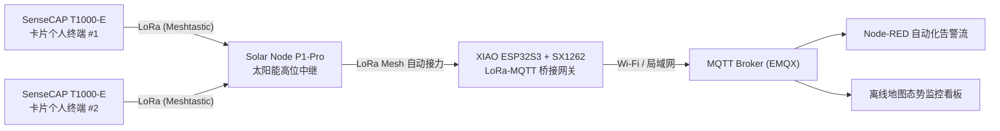

# M3 自组网与韧性通信（仅海外）

**一句话定位：** 基于 LoRa 网状拓扑技术应用（Mesh），构建无公网依赖、多跳中继的应急通信与离网传感数据回传网络。

## 目标场景

面向野外勘探、应急搜救、地下管廊/隧道施工、林区无网园区等场景，解决蜂窝基站覆盖盲区失联、单点中继故障导致整网中断、临时专网架设周期长等问题。本方案基于 LoRa 物理层与开源 Meshtastic Mesh 协议，构建去中心化、多跳中继的离线通信网络，支持文字消息、GPS 坐标与轻量传感器数据的无公网回传；L2 可通过 ESP32S3 网关桥接 MQTT 实现态势大屏监控，L3 可基于 Wio Tracker L1 定制固件并集成环境传感器。

## 核心痛点（现场与应急视角）

| 痛点 | 典型表现与工程代价 | 解决方案与架构 |
| --- | --- | --- |
| 偏远与地下盲区失联 | 野外、隧道、地下管廊等区域缺乏蜂窝基站覆盖，传统对讲机视距受限且无法回传坐标 | 基于 LoRa 物理层与 Meshtastic 协议自组网，实现离线文字与 GPS 坐标多跳接力回传 |
| 单点中继故障风险 | 传统中继台方案依赖单一高位节点或市电供电，中继受损后整网中断 | 去中心化 Mesh 拓扑，任意节点均可承担中继转发，支持动态多路径冗余 |
| 应急通信架设成本高 | 卫星电话终端昂贵且存在遮挡盲区，临时架设专网基站工程量大、响应周期长 | 便携式电池/太阳能供电设备，开机自动入网，分钟级完成现场覆盖扩展 |

## 核心方案价值

- **零基础设施依赖**：不依赖 4G/5G 基站与互联网连接，设备上电即自动加入网状网络
- **多跳中继与自动路由**：支持最多 7 跳（默认 3 跳）自动中继转发，有效绕过山体、建筑物等物理遮挡
- **低功耗与长续航**：LoRa 调制功耗极低，支持太阳能节点（Solar Node）长期免维护部署
- **公网融合网关扩展**：支持通过 ESP32 网关将 Mesh 数据桥接至 MQTT 消息服务器与地图大屏

## 能力层级

| 能力层级 | 能力 / 课程 | 核心目标 | 典型实操与交付 |
| --- | --- | --- | --- |
| **L1 展示层** | 体验 · 体验课（1 天） | 掌握 Meshtastic 组网配置与离线通信 | 完成 T1000-E 卡片终端与 Solar Node 中继器的配网、信道设置、离线消息与位置共享 |
| **L2 顾问层** | 实战 · 实战课（2–3 天） | 掌握 Mesh 网络监控与 MQTT 桥接 | 使用 ESP32S3 网关将 Mesh 数据接入 MQTT，在 Node-RED 与离线地图大屏上实现态势监控与异常告警 |
| **L3 设计层** | 交付 · 交付课（3–5 天） | 掌握离网传感器集成与固件定制开发 | 基于 Wio Tracker L1 Pro 开发自定义 Meshtastic 固件，接入 BME280 等环境传感器并实现数据包编码回传 |

## 能力指标

### L1 展示层（基础组网与通信）

- 理解 LoRa 调制特性（扩频因子 SF、带宽 BW、编码率 CR）与 Mesh 路由跳数机制
- 熟练使用 Meshtastic App 完成信道加密（PSK）、预设模式（LongFast/MediumFast）与节点角色配置
- 掌握多节点中继布设与离线地图下的点对点 / 广播通信

### L2 顾问层（公网桥接与态势监控）

- 使用 ESP32S3 + Wio-SX1262 搭建 LoRa Mesh ↔ MQTT 互联网网关
- 在 Node-RED 中解析 Meshtastic MQTT 遥测报文（默认 Protobuf，JSON 输出需另行配置）
- 搭建离线地图看板（如 Meshtastic Map），实现地理围栏与 SOS 告警联动

### L3 设计层（端侧固件开发与传感集成）

- 掌握基于 PlatformIO 的 Meshtastic 源码编译、模块定制与固件刷写
- 在 Wio Tracker L1 Pro 屏幕上自定义数据显示 UI（未读数、环境指标）
- 接入 I2C/UART 传感器，完成遥测数据封包并在 Mesh 网络中稳定上报

## 适用场景

- **野外勘探与户外赛事**：队员位置实时追踪、分组文字通信、一键 SOS 告警广播
- **应急搜救与抢险救灾**：受灾失联区域多跳中继搭建、前线搜救态势标绘
- **地下管廊、隧道与矿道施工**：分段中继穿透阻隔、有害气体与温湿度离网监测
- **林区与无网园区监控**：太阳能中继节点长期值守、关键设施运行状态回传

## 技术栈

LoRa · Meshtastic · ESP32-S3 · Wio Tracker L1 Pro · MQTT · Node-RED · PlatformIO · C/C++ · BME280

## 能力边界

- **核心能力**：短文本即时通讯、GPS 定位轨迹回传、传感器轻量遥测数据传输、去中心化多跳路由
- **系统边界**：受 LoRa 物理带宽限制（几百 bps ~ 数 kbps），**不支持语音通话、实时视频与大文件传输**
- **网络特性**：网络容量受空口占空比与跳数影响，节点数过多时需合理规划信道参数与上报频率
- **市场范围**：当前套件频段为 433/868/915 MHz（Meshtastic 社区频段），**仅面向海外市场交付**

## 课程速览

| 项目 | L1 展示层 · 体验 | L2 顾问层 · 实战 | L3 设计层 · 交付 |
| --- | --- | --- | --- |
| **天数** | 1 天 | 2–3 天 | 3–5 天 |
| **配套硬件** | 详见 [M3.2 培训设备清单](M3.2 培训设备清单.md)（含 Mission Pack、T1000-E、Solar Node、S3 网关、L1 Pro 及 BME280） |
| **学员基础** | 会使用智能手机与蓝牙配对，了解基础物联网概念 | 具备 Node-RED 或 MQTT 基础，能配置网络与 Broker | 熟悉 C/C++ 与 PlatformIO，能阅读并修改开源固件源码 |
| **学完交付物** | 完成 3 节点以上现场组网，实现离线消息、群组广播与位置共享 | 完成 LoRa-MQTT 网关上线，并在看板呈现多节点状态与告警 | 完成集成环境传感器的 Wio Tracker L1 Pro 定制固件编译与实机验证 |

## 系统解决方案架构

### L1/L2 现场应急组网与态势感知大屏

### L3 端侧固件定制与传感器遥测集成

