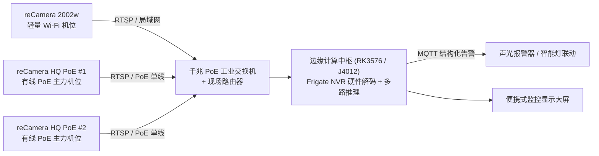
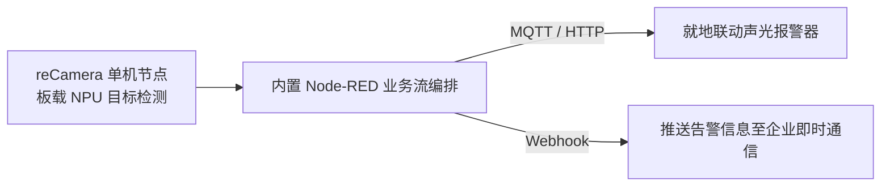

# M4 边缘视觉 AI

**一句话定位：** 基于轻量边缘摄像头（reCamera）与工业级多路 AI 计算主机（Jetson Orin NX / Frigate NVR），构建目标检测、区域入侵告警与自动化联动的边缘视觉方案。

## 目标场景

面向物业园区周界防范、工业制造安全生产、商业客流统计、农业户外监控等场景，解决传统监控仅能事后录像回溯、移动侦测受光线与背景干扰误报率高、视觉 AI 落地门槛高等问题。本方案采用双硬件主线：reCamera 作为单点轻量边缘节点，实现即插即用的目标检测与 RTSP 视频流输出；reServer Industrial J4012（Jetson Orin NX）作为多路汇聚 NVR，运行 Frigate 实现多路 RTSP 视频流的硬件解码、目标检测、区域入侵告警与 Home Assistant 联动。

## 硬件双主线定位与选型对比

| 场景需求与规模 | 推荐方案 | 架构说明 | 典型算力与吞吐 |
| --- | --- | --- | --- |
| **单点位 / 快速验证 / 移动工位** | **reCamera 方案** (边缘轻节点) | 摄像头与 AI 芯片一体化，内置 Node-RED 零代码编排，即插即用 | 单路 1080P 视频流本地实时推理 |
| **多路汇聚 / 工业现场 / 复杂规则** | **Jetson + Frigate 方案** (边缘计算主机) | 汇聚多路网络摄像头 RTSP 流，基于 GPU 硬件加速推理与 NVR 录像管理 | 多路 1080P RTSP 并发实时检测，支持 TensorRT 加速 |

## 核心痛点（监控与现场安防视角）

| 痛点 | 表现与工程代价 | 解决方案与架构 |
| --- | --- | --- |
| 缺乏实时事件感知 | 传统监控多仅提供录像存储与事后人工回溯，无法在风险发生瞬间产生结构化告警 | 边缘端实时运行目标检测与入侵检测，毫秒级输出结构化告警事件 |
| 误报率高与规则单一 | 传统移动侦测受光线变化、雨雪晃动干扰严重，导致频繁误触发 | 基于深度学习目标检测模型（人/车/特定目标过滤），结合检测区域与置信度阈值调优 |
| 视觉 AI 落地与工程门槛高 | 传统定制开发周期长、需专门算法工程师与专用服务机架 | 开箱即用预置模型、Node-RED 零代码编排与标准 RTSP/MQTT 协议快速集成 |
| 边缘算力适配困难 | 方案商难以权衡单点嵌入式设备与多路集中服务器的性能与成本 | 明确轻节点（reCamera）与强节点（Jetson）分层架构，按点位规模弹性配置 |

## 方案核心价值

- **双硬件灵活适配**：覆盖从单点轻量即插即用（reCamera）到多路中枢汇聚（Jetson Orin NX）
- **全开放标准协议**：支持 RTSP 视频流、MQTT 消息发布、REST API 与 Home Assistant 跨系统联动
- **全流程能力覆盖**：从预置模型开箱配置、多路 NVR 规则编排到自定义数据集标注、训练与边缘部署（L3）

## 能力层级

| 能力层级 | 能力词 / 课程名 | 核心目标 | 典型实操与交付 |
| --- | --- | --- | --- |
| **L1 展示层** | 体验 · 体验课（1 天） | 掌握边缘视觉基础概念与轻量节点配置 | 完成 reCamera 网络初始化、RTSP 视频流接入、预置模型切换与基础入侵检测 |
| **L2 顾问层** | 实战 · 实战课（2–3 天） | 掌握双线场景联动与多路 NVR 汇聚 | 完成 reCamera + Node-RED 声光告警联动，并在 Jetson 上配置 Frigate 多路 RTSP 接入与 HA 自动化 |
| **L3 设计层** | 交付 · 交付课（3–5 天） | 掌握自定义模型训练与边缘部署优化 | 采集并标注特定场景数据集，使用 YOLO 训练自定义模型，完成 TensorRT / cvimodel 转换与推理看板搭建 |

## 能力指标

### L1 展示层（体验）

- 理解边缘计算、帧率（FPS）、置信度阈值（Confidence）与交并比（IoU）等视觉核心参数
- 完成 reCamera 网页端配置、RTSP 视频流输出验证与预置目标检测模型切换
- 掌握 reCamera 与 Jetson 方案的性能边界与工程选型依据

### L2 顾问层（实战）

- 在 reCamera 上使用 Node-RED 编排告警流，实现基于 MQTT 的声光报警器与企业微信通知联动
- 在 Jetson 上配置 `frigate.yml`，完成 2-4 路 RTSP 视频流接入、检测区域（Zones）与告警规则定义
- 完成 Frigate 与 Home Assistant 联动配置，实现跨系统自动化设备控制与误报率调优

### L3 设计层（交付）

- 掌握使用 CVAT / Roboflow 进行特定目标（如安全帽、工服）的数据集标注与数据增强
- 掌握 YOLO 迁移学习训练流程与 mAP 精度指标评估
- 完成 ONNX 导出、TensorRT (Jetson) 与 cvimodel (reCamera) 边缘端模型量化与部署
- 将结构化检测数据写入 InfluxDB 并搭建 Grafana 业务监控看板

## 适用场景

- **物业与园区安防**：周界防范、人员越界告警、夜间异常驻留检测
- **工业制造与安全生产**：未佩戴安全帽/反光衣检测、危险区域人员闯入、输送带状态监控
- **智慧客流与商业统计**：区域人流计数、驻留时长热力图
- **农业与室外监控**：PoE 供电户外点位监测、特定目标识别

## 技术栈

reCamera · Jetson Orin NX · Frigate NVR · Home Assistant · Node-RED · YOLO · TensorRT · MQTT · RTSP · InfluxDB · Grafana

## 能力边界

- **核心能力**：通用与特定目标检测、入侵与越界检测、多路 RTSP 视频流分析、结构化事件联动
- **合规红线**：**不包含人脸身份识别与生物特征追踪**
- **系统定位**：视觉分析属于**辅助决策与事件告警工具**，不用于毫秒级生命安全制动控制
- **性能边界**：reCamera 单机为单摄像头轻量方案，支持 1 路 1080P 实时推理与 RTSP 推流；边缘主机（RK3576 / J4012）支持多路并发汇聚分析与 NVR 录像管理

## 课程速览

| 能力层级 | 天数 | 学员基础 | 学完交付物 |
| --- | --- | --- | --- |
| **L1 展示层 · 体验** | 1 天 | 具备基础网络与浏览器操作经验，能连接 Wi-Fi 与访问 Web 界面 | 完成 1 台 reCamera 网络初始化、RTSP 输出验证与预置模型切换 |
| **L2 顾问层 · 实战** | 2–3 天 | 理解 IP 网络、Docker 与 MQTT 基础，能编辑 YAML 配置文件 | 完成 reCamera Node-RED 联动流 + 边缘主机多路接入与自动化报警 |
| **L3 设计层 · 交付** | 3–5 天 | 具备 Python 与 Linux 命令行基础，了解目标检测基本原理 | 交付自定义 YOLO 模型并在边缘端完成 TensorRT 量化与推理实跑 |

- **配套硬件**：详细设备型号、台架连接与采购规格以 [M4.2 培训设备清单](M4.2 培训设备清单.md) 为准（包含 reComputer RK3576-30、reCamera 2002w/PoE、PoE 交换机、三脚架、路由器、便携屏及可选 J4012 边缘服务器）。

## 系统解决方案架构

### 多机位视觉汇聚与 NVR 集中分析架构

### 单点轻节点端侧闭环架构

